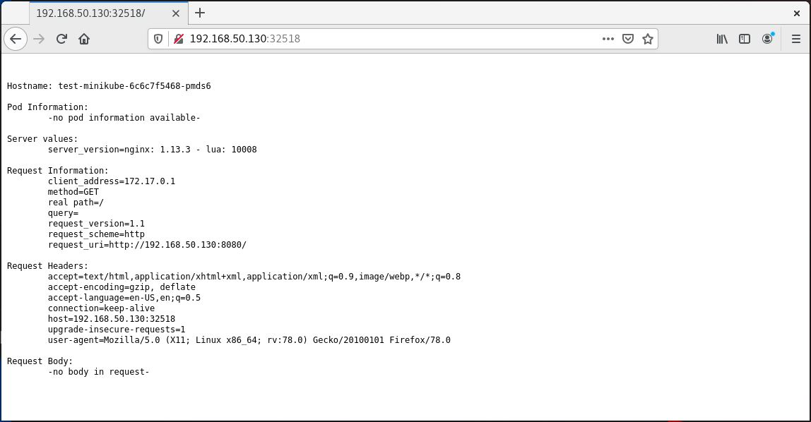
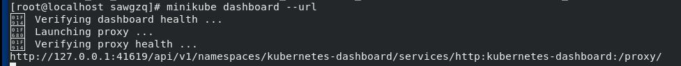
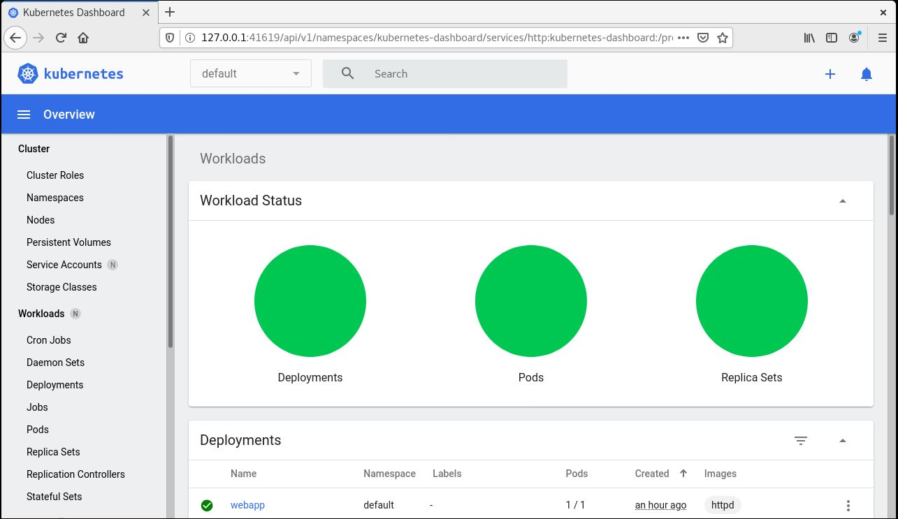

># DevOps with Docker and Kubernetes 
>### IT CS3530 UNIX Operating Systems
>### Simon Welge, SAWGZQ
## Topic: DevOps With Docker and Kubernetes
I chose Docker and Kubernetes because I think containerization is a really interesting technology that will only be used more and more frequently in the future. I also focus much of my work in web development, so being able to build a container and then spin up an AWS instance with almost no configuration is really appealing. For my final project, I would like to get multiple different containers running docker and use Kubernetes to host and manage them. 
## Research: Docker

### What is Docker?
Docker is a set of platform-as-service products that use operating system level virtualization to deliver software in packages called containers. These containers run on the Docker engine, which runs on the operating system. 
### Docker Engine
The Docker Engine refers to the Docker Daemon, CLI (command line interface), as well as APIs which specify interfaces that programs can use to communicate with the Docker daemon. The Docker Engine is really important because it is the base environment for the containers to run off of.
### What is a container?
We have already established that Docker is a way to neatly package an encapsulate applications, but we haven't touched on containers fully. Docker's definition of a container is as such:
>A container is a standard unit of software that packages up code and all its dependencies so the application runs quickly and reliably from one computing environment to another. A Docker container image is a lightweight, standalone, executable package of software that includes everything needed to run an application: code, runtime, system tools, system libraries and settings.  [Source](https://www.docker.com/resources/what-container)

The idea is that instead of using an entire virtual machine for your application or webserver, you can containerize it; and thus, save on resources to run more applications. Docker containers
Below are visualizations of how containerization is different than using virtual machines.

##### Containerized applications take up less space, and don't require a guest operating system for each. [Source](https://www.zdnet.com/article/what-is-docker-and-why-is-it-so-darn-popular/)
## Research: Kubernetes
### What is Kubernetes? 
Kubernetes, also known as k8, is an open source system for automatically deploying, scaling, and managing containerized applications. Where docker was a much lower-level development tool, Kubernetes is a deployment tool that can manage all of your containers. 

##### Visualization of types of deployment. Kubernetes and Docker make a effective pairing. [Source](https://m-square.com.au/top-questions-answered-docker-and-kubernetes-i-thought-you-were-competitors/)

## Application: Install Kubernetes and run the Dashboard
### Summary
Kubernetes' Dashboard is incredibly useful; it gives the status of running or deployed images at a glance, and allows the execution of CLI commands from a gui interface. [This](https://www.linuxtechi.com/install-kubernetes-k8s-minikube-centos-8/) was the post that I followed along with.
These are all commands that I ran on my machine, which was running Redhat Linux.
### Installing Dependencies

    # dnf config-manager --add-repo=https://download.docker.com/linux/centos/docker-ce.repo
    # dnf install docker-ce --nobest -y
    
Then, start and enable docker.

    # systemctl start docker
    # systemctl enable docker
Install conntrack, which is a dependency for minikube

    # dnf install conntrack -y

### Installing kubectl
You can install minikube using these commands:

    # curl -LO https://storage.googleapis.com/kubernetes-release/release/`curl -s https://storage.googleapis.com/kubernetes-release/release/stable.txt`/bin/linux/amd64/kubectl
    # chmod +x ./kubectl
    # mv ./kubectl /usr/local/bin/kubectl
    # kubectl version --client

start minikube by using the following command:

    # minikube start --driver=none
   
   You can check status of minikube by running,

    # minikube status
Check to make sure the installation is running by

    # kubectl create deployment test-minikube --image=k8s.gcr.io/echoserver:1.10
    # kubectl expose deployment test-minikube --type=NodePort --port=8080
    ## minikube service test-minikube --url

and navigate to the given url:

After getting this page, you can run,

    # minikube dashboard --url

This is our dashboard url. We can navigate to the frontend of minikube by going to the given URL in a web browser.

